# Диаграмма бизнес-процесса

## Визуальное представление процесса

```mermaid
graph LR
    classDef external fill:yellow,stroke:#333,stroke-width:2px;;
    classDef final fill:red,stroke:#333,stroke-width:2px,color:white;;
    classDef merge fill:orange,stroke:#333,stroke-width:2px;;
    classDef split fill:purple,stroke:#333,stroke-width:2px,color:white;;
    classDef critical fill:#ff4444,stroke:#000,stroke-width:3px,color:white,stroke-dasharray:5 5;;
    Данные_о_спросе(["Данные о спросе"]):::external
    Жалоба_клиента(["Жалоба клиента"]):::external
    Запрос_клиента(["Запрос клиента"]):::external
    Запрос_на_возврат(["Запрос на возврат"]):::external
    Исторические_продажи(["Исторические продажи"]):::external
    Сезонность(["Сезонность"]):::external
    Товар_продан(["Товар продан"]):::external
    Возврат_обработан(["Возврат обработан"]):::final
    Жалоба_решена(["Жалоба решена"]):::final
    Заказ_закрыт(["Заказ закрыт"]):::final
    План_закупок(["План закупок"]):::final
    subgraph Аналитик["Аналитик"]
    Прогнозирование_спроса["Прогнозирование спроса: Прогнозирование будущего спроса"]:::merge
    end
    subgraph Бухгалтер["Бухгалтер"]
    Ожидание_оплаты["Ожидание оплаты: Ожидание поступления оплаты от клиента"]
    Формирование_счета["Формирование счета: Создание счета с учетом доставки и налогов"]
    end
    subgraph Директор["Директор"]
    Корректирующие_действия["Корректирующие действия: Разработка плана улучшения качества"]
    end
    subgraph Закупщик["Закупщик"]
    Закупка_материалов["Закупка материалов: Закупка материалов для производства"]:::merge
    Планирование_закупок["Планирование закупок: Планирование объемов закупок"]:::merge
    end
    subgraph Кладовщик["Кладовщик"]
    Подготовка_к_отгрузке["Подготовка к отгрузке: Упаковка товара и подготовка к отправке"]:::merge
    Поступление_на_склад["Поступление на склад: Размещение товара на складе"]
    Проверка_наличия["Проверка наличия: Проверка наличия товара на складе"]
    Резервирование_товара["Резервирование товара: Резервирование товара для заказа"]:::split
    Учет_остатков["Учет остатков: Обновление данных об остатках"]:::merge
    end
    subgraph Контролер["Контролер"]
    Контроль_качества["Контроль качества: Проверка качества готовой продукции"]
    end
    subgraph Логист["Логист"]
    Отслеживание_доставки["Отслеживание доставки: Мониторинг статуса доставки"]
    Оформление_доставки["Оформление доставки: Оформление доставки через курьерскую службу"]
    end
    subgraph Менеджер["Менеджер"]
    Закрытие_заказа["Закрытие заказа: Окончательное закрытие заказа в системе"]
    Обработка_возвратов["Обработка возвратов: Обработка запросов на возврат товара"]
    Отправка_счета["Отправка счета: Отправка счета клиенту по email"]
    Подтверждение_получения["Подтверждение получения: Подтверждение получения от клиента"]
    Прием_жалоб["Прием жалоб: Регистрация и классификация жалоб"]
    Прием_заказа["Прием заказа: Проверка доступности товара и подтверждение заказа"]
    Расследование_жалобы["Расследование жалобы: Анализ причин возникновения жалобы"]:::split
    Решение_по_жалобе["Решение по жалобе: Принятие решения по устранению жалобы"]
    end
    subgraph Менеджер_качества["Менеджер качества"]
    Анализ_качества["Анализ качества: Анализ тенденций качества продукции"]
    Учет_качества["Учет качества: Сбор статистики по качеству товаров"]
    end
    subgraph Производственник["Производственник"]
    Производство["Производство: Производство товаров согласно плану"]
    end
    Прием_заказа-- "Подтвержденный заказ" -->Проверка_наличия
    Запрос_клиента-- "Запрос клиента" -->Прием_заказа
    Проверка_наличия-- "Информация о наличии" -->Резервирование_товара
    Резервирование_товара-- "Зарезервированный товар" -->Формирование_счета
    Резервирование_товара-- "Зарезервированный товар" -->Подготовка_к_отгрузке
    Формирование_счета-- "Счет на оплату" -->Отправка_счета
    Отправка_счета-- "Счет отправлен" -->Ожидание_оплаты
    Ожидание_оплаты-- "Оплата получена" -->Подготовка_к_отгрузке
    Подготовка_к_отгрузке-- "Товар упакован" -->Оформление_доставки
    Оформление_доставки-- "Товар передан в доставку" -->Отслеживание_доставки
    Отслеживание_доставки-- "Товар доставлен" -->Подтверждение_получения
    Подтверждение_получения-- "Получение подтверждено" -->Закрытие_заказа
    Закрытие_заказа-- "Заказ закрыт" -->Заказ_закрыт
    Обработка_возвратов-- "Возврат обработан" -->Возврат_обработан
    Запрос_на_возврат-- "Запрос на возврат" -->Обработка_возвратов
    Прием_жалоб-- "Жалоба зарегистрирована" -->Расследование_жалобы
    Жалоба_клиента-- "Жалоба клиента" -->Прием_жалоб
    Расследование_жалобы-- "Причина жалобы" -->Решение_по_жалобе
    Расследование_жалобы-- "Причина жалобы" -->Учет_качества
    Решение_по_жалобе-- "Жалоба решена" -->Жалоба_решена
    Учет_качества-- "Данные о качестве" -->Анализ_качества
    Анализ_качества-- "Отчет о качестве" -->Корректирующие_действия
    Корректирующие_действия-- "План улучшений" -->Закупка_материалов
    Закупка_материалов-- "Материалы закуплены" -->Производство
    Данные_о_спросе-- "Данные о спросе" -->Закупка_материалов
    Производство-- "Готовая продукция" -->Контроль_качества
    Контроль_качества-- "Товар проверен" -->Поступление_на_склад
    Поступление_на_склад-- "Товар на складе" -->Учет_остатков
    Учет_остатков-- "Остатки на складе" -->Планирование_закупок
    Товар_продан-- "Товар продан" -->Учет_остатков
    Прогнозирование_спроса-- "Прогноз спроса" -->Планирование_закупок
    Исторические_продажи-- "Исторические продажи" -->Прогнозирование_спроса
    Сезонность-- "Сезонность" -->Прогнозирование_спроса
    Планирование_закупок-- "План закупок" -->План_закупок
```

## Анализ узлов слияния, разветвления и супер-критичных точек

### Супер-критические операции (одновременно ≥ 3 входов и выход используется ≥ 3 раз):
- Таких операций нет

### Критические точки слияния:
- **Подготовка к отгрузке**: 2 входов
- **Закупка материалов**: 2 входов
- **Учет остатков**: 2 входов
- **Прогнозирование спроса**: 2 входов
- **Планирование закупок**: 2 входов

### Критические точки разветвления:
- **Зарезервированный товар** (из Резервирование товара): идёт в 2 операций
- **Причина жалобы** (из Расследование жалобы): идёт в 2 операций

## Реестр входов/выходов

| Вход/Выход | Исходная операция | Последующие операции |
|---|---|---|
| Возврат обработан | Обработка возвратов | КОНЕЧНЫЙ ВЫХОД |
| Готовая продукция | Производство | Контроль качества |
| Данные о качестве | Учет качества | Анализ качества |
| Данные о спросе | ВНЕШНИЙ ВХОД | Закупка материалов |
| Жалоба зарегистрирована | Прием жалоб | Расследование жалобы |
| Жалоба клиента | ВНЕШНИЙ ВХОД | Прием жалоб |
| Жалоба решена | Решение по жалобе | КОНЕЧНЫЙ ВЫХОД |
| Заказ закрыт | Закрытие заказа | КОНЕЧНЫЙ ВЫХОД |
| Запрос клиента | ВНЕШНИЙ ВХОД | Прием заказа |
| Запрос на возврат | ВНЕШНИЙ ВХОД | Обработка возвратов |
| Зарезервированный товар | Резервирование товара | Формирование счета, Подготовка к отгрузке |
| Информация о наличии | Проверка наличия | Резервирование товара |
| Исторические продажи | ВНЕШНИЙ ВХОД | Прогнозирование спроса |
| Материалы закуплены | Закупка материалов | Производство |
| Оплата получена | Ожидание оплаты | Подготовка к отгрузке |
| Остатки на складе | Учет остатков | Планирование закупок |
| Отчет о качестве | Анализ качества | Корректирующие действия |
| План закупок | Планирование закупок | КОНЕЧНЫЙ ВЫХОД |
| План улучшений | Корректирующие действия | Закупка материалов |
| Подтвержденный заказ | Прием заказа | Проверка наличия |
| Получение подтверждено | Подтверждение получения | Закрытие заказа |
| Причина жалобы | Расследование жалобы | Решение по жалобе, Учет качества |
| Прогноз спроса | Прогнозирование спроса | Планирование закупок |
| Сезонность | ВНЕШНИЙ ВХОД | Прогнозирование спроса |
| Счет на оплату | Формирование счета | Отправка счета |
| Счет отправлен | Отправка счета | Ожидание оплаты |
| Товар доставлен | Отслеживание доставки | Подтверждение получения |
| Товар на складе | Поступление на склад | Учет остатков |
| Товар передан в доставку | Оформление доставки | Отслеживание доставки |
| Товар проверен | Контроль качества | Поступление на склад |
| Товар продан | ВНЕШНИЙ ВХОД | Учет остатков |
| Товар упакован | Подготовка к отгрузке | Оформление доставки |

## Реестр операций

| Операция | Группа | Владелец | Входы | Выход | Тип узла | Подробное описание |
|---|---|---|---|---|---|---|
| Прием заказа | Продажи | Менеджер | Запрос клиента | Подтвержденный заказ | Обычный | Проверка доступности товара и подтверждение заказа |
| Проверка наличия | Склад | Кладовщик | Подтвержденный заказ | Информация о наличии | Обычный | Проверка наличия товара на складе |
| Резервирование товара | Склад | Кладовщик | Информация о наличии | Зарезервированный товар | Разветвление | Резервирование товара для заказа |
| Формирование счета | Финансы | Бухгалтер | Зарезервированный товар | Счет на оплату | Обычный | Создание счета с учетом доставки и налогов |
| Отправка счета | Продажи | Менеджер | Счет на оплату | Счет отправлен | Обычный | Отправка счета клиенту по email |
| Ожидание оплаты | Финансы | Бухгалтер | Счет отправлен | Оплата получена | Обычный | Ожидание поступления оплаты от клиента |
| Подготовка к отгрузке | Склад | Кладовщик | Зарезервированный товар, Оплата получена | Товар упакован | Слияние | Упаковка товара и подготовка к отправке |
| Оформление доставки | Логистика | Логист | Товар упакован | Товар передан в доставку | Обычный | Оформление доставки через курьерскую службу |
| Отслеживание доставки | Логистика | Логист | Товар передан в доставку | Товар доставлен | Обычный | Мониторинг статуса доставки |
| Подтверждение получения | Продажи | Менеджер | Товар доставлен | Получение подтверждено | Обычный | Подтверждение получения от клиента |
| Закрытие заказа | Продажи | Менеджер | Получение подтверждено | Заказ закрыт | Обычный | Окончательное закрытие заказа в системе |
| Обработка возвратов | Сервис | Менеджер | Запрос на возврат | Возврат обработан | Обычный | Обработка запросов на возврат товара |
| Прием жалоб | Сервис | Менеджер | Жалоба клиента | Жалоба зарегистрирована | Обычный | Регистрация и классификация жалоб |
| Расследование жалобы | Сервис | Менеджер | Жалоба зарегистрирована | Причина жалобы | Разветвление | Анализ причин возникновения жалобы |
| Решение по жалобе | Сервис | Менеджер | Причина жалобы | Жалоба решена | Обычный | Принятие решения по устранению жалобы |
| Учет качества | Качество | Менеджер качества | Причина жалобы | Данные о качестве | Обычный | Сбор статистики по качеству товаров |
| Анализ качества | Качество | Менеджер качества | Данные о качестве | Отчет о качестве | Обычный | Анализ тенденций качества продукции |
| Корректирующие действия | Производство | Директор | Отчет о качестве | План улучшений | Обычный | Разработка плана улучшения качества |
| Закупка материалов | Закупки | Закупщик | Данные о спросе, План улучшений | Материалы закуплены | Слияние | Закупка материалов для производства |
| Производство | Производство | Производственник | Материалы закуплены | Готовая продукция | Обычный | Производство товаров согласно плану |
| Контроль качества | Качество | Контролер | Готовая продукция | Товар проверен | Обычный | Проверка качества готовой продукции |
| Поступление на склад | Склад | Кладовщик | Товар проверен | Товар на складе | Обычный | Размещение товара на складе |
| Учет остатков | Склад | Кладовщик | Товар на складе, Товар продан | Остатки на складе | Слияние | Обновление данных об остатках |
| Прогнозирование спроса | Аналитика | Аналитик | Исторические продажи, Сезонность | Прогноз спроса | Слияние | Прогнозирование будущего спроса |
| Планирование закупок | Закупки | Закупщик | Остатки на складе, Прогноз спроса | План закупок | Слияние | Планирование объемов закупок |

## Статистика процесса

- **Всего операций**: 25
- **Владелец для диаграммы**: 10
- **Группы в данных**: 9
- **Внешние входы**: 7
- **Конечные выходы**: 4
- **Операций слияния**: 5
- **Операций разветвления**: 2
- **Супер-критических операций**: 0

## Легенда

- **Желтые овалы** – внешние входы
- **Красные овалы** – конечные выходы
- **Оранжевые прямоугольники** – операции слияния
- **Фиолетовые прямоугольники** – операции разветвления
- **Пульсирующие красные прямоугольники** – супер-критические операции
- **Обычные прямоугольники** – стандартные операции
- **Группы на диаграмме** – зоны ответственности владелец
- **Текст узлов** – содержит подробное описание операций
