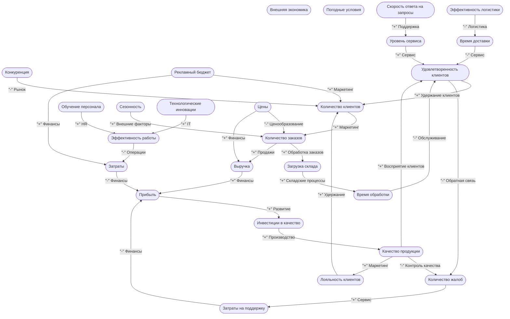

# Causal Loop Diagram

## Диаграмма причинно-следственных связей

## Реестр причинно-следственных связей

| Источник | Цель | Влияние | Операция | Сила влияния | Описание |
|---|---|---|---|---|---|
| Количество клиентов | Количество заказов | + | Маркетинг | Высокая | Чем больше клиентов, тем больше заказов |
| Количество заказов | Загрузка склада | + | Обработка заказов | Средняя | Рост заказов увеличивает нагрузку на склад |
| Загрузка склада | Время обработки | + | Складские процессы | Высокая | Высокая загрузка увеличивает время обработки |
| Время обработки | Удовлетворенность клиентов | - | Обслуживание | Высокая | Долгая обработка снижает удовлетворенность |
| Удовлетворенность клиентов | Количество клиентов | + | Удержание клиентов | Средняя | Довольные клиенты приводят новых |
| Удовлетворенность клиентов | Количество жалоб | - | Обратная связь | Высокая | Низкая удовлетворенность ведет к жалобам |
| Количество жалоб | Затраты на поддержку | + | Сервис | Средняя | Жалобы требуют ресурсов на обработку |
| Затраты на поддержку | Прибыль | - | Финансы | Средняя | Рост затрат снижает прибыль |
| Прибыль | Инвестиции в качество | + | Развитие | Низкая | Прибыль позволяет инвестировать в качество |
| Инвестиции в качество | Качество продукции | + | Производство | Высокая | Инвестиции улучшают качество |
| Качество продукции | Количество жалоб | - | Контроль качества | Высокая | Высокое качество снижает жалобы |
| Качество продукции | Удовлетворенность клиентов | + | Восприятие клиентов | Высокая | Качество повышает удовлетворенность |
| Количество заказов | Выручка | + | Продажи | Высокая | Заказы напрямую влияют на выручку |
| Выручка | Прибыль | + | Финансы | Средняя | Рост выручки увеличивает прибыль |
| Цены | Количество заказов | - | Ценообразование | Средняя | Высокие цены могут снижать количество заказов |
| Цены | Выручка | + | Финансы | Высокая | Рост цен увеличивает выручку при прочих равных |
| Конкуренция | Количество клиентов | - | Рынок | Высокая | Высокая конкуренция снижает приток клиентов |
| Качество продукции | Лояльность клиентов | + | Маркетинг | Высокая | Качество повышает лояльность |
| Лояльность клиентов | Количество клиентов | + | Удержание | Средняя | Лояльные клиенты остаются и рекомендуют |
| Рекламный бюджет | Количество клиентов | + | Маркетинг | Высокая | Реклама привлекает новых клиентов |
| Рекламный бюджет | Затраты | + | Финансы | Высокая | Реклама увеличивает затраты |
| Затраты | Прибыль | - | Финансы | Высокая | Рост затрат снижает прибыль |
| Эффективность логистики | Время доставки | - | Логистика | Высокая | Эффективная логистика ускоряет доставку |
| Время доставки | Удовлетворенность клиентов | - | Сервис | Средняя | Быстрая доставка повышает удовлетворенность |
| Обучение персонала | Эффективность работы | + | HR | Средняя | Обучение повышает эффективность |
| Эффективность работы | Затраты | - | Операции | Низкая | Эффективность снижает операционные затраты |
| Сезонность | Количество заказов | + | Внешние факторы | Высокая | Сезонность влияет на спрос |
| Технологические инновации | Эффективность работы | + | IT | Высокая | Инновации повышают эффективность |
| Уровень сервиса | Удовлетворенность клиентов | + | Сервис | Высокая | Качество сервиса влияет на удовлетворенность |
| Скорость ответа на запросы | Уровень сервиса | + | Поддержка | Средняя | Быстрые ответы улучшают сервис |

## Обнаруженные петли обратной связи

1. Количество клиентов → Количество заказов → Загрузка склада → Время обработки → Удовлетворенность клиентов
2. Количество жалоб → Затраты на поддержку → Прибыль → Инвестиции в качество → Качество продукции
3. Удовлетворенность клиентов → Количество жалоб → Затраты на поддержку → Прибыль → Инвестиции в качество → Качество продукции
4. Количество клиентов → Количество заказов → Загрузка склада → Время обработки → Удовлетворенность клиентов → Количество жалоб → Затраты на поддержку → Прибыль → Инвестиции в качество → Качество продукции → Лояльность клиентов
