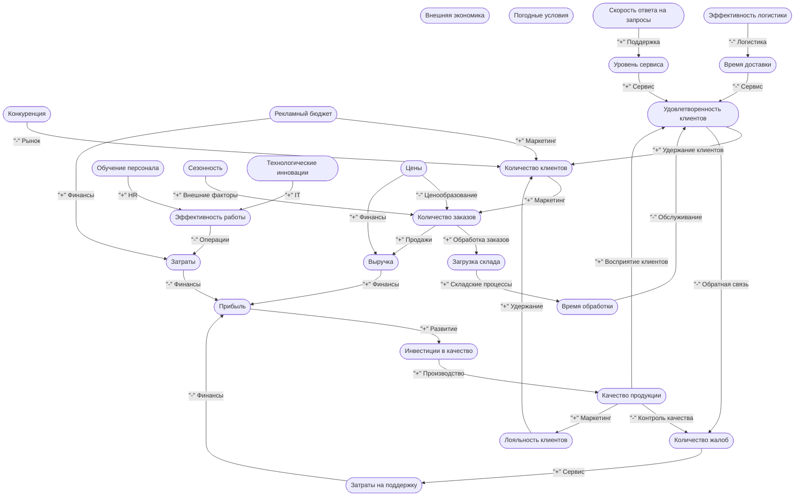

# Генератор диаграмм бизнес-процессов v3.5

[**Скачать**](https://github.com/AntiManager/BusinessProcessMermaidGenerator/releases/latest/download/BusinessProcessGenerator.exe)

## 🎯 Назначение программы

**Генератор диаграмм бизнес-процессов** - это мощный инструмент для визуализации и анализа организационных процессов, который преобразует простые табличные данные в профессиональные диаграммы. Программа предназначена для:

- **Бизнес-аналитиков** - документирование и оптимизация процессов
- **Руководителей** - понимание взаимосвязей и выявление узких мест  
- **Системных аналитиков** - моделирование сложных систем и обратных связей
- **Консультантов** - наглядная демонстрация процессов клиентам

```mermaid
graph LR
    classDef external fill:yellow,stroke:#333,stroke-width:2px;;
    classDef final fill:red,stroke:#333,stroke-width:2px,color:white;;
    classDef merge fill:orange,stroke:#333,stroke-width:2px;;
    classDef split fill:purple,stroke:#333,stroke-width:2px,color:white;;
    classDef critical fill:#ff4444,stroke:#000,stroke-width:3px,color:white,stroke-dasharray:5 5;;
    Данные_о_спросе(["Данные о спросе"]):::external
    Жалоба_клиента(["Жалоба клиента"]):::external
    Запрос_клиента(["Запрос клиента"]):::external
    Запрос_на_возврат(["Запрос на возврат"]):::external
    Исторические_продажи(["Исторические продажи"]):::external
    Сезонность(["Сезонность"]):::external
    Товар_продан(["Товар продан"]):::external
    Возврат_обработан(["Возврат обработан"]):::final
    Жалоба_решена(["Жалоба решена"]):::final
    Заказ_закрыт(["Заказ закрыт"]):::final
    План_закупок(["План закупок"]):::final
    subgraph group_Аналитик["Аналитик"]
    Прогнозирование_спроса["Прогнозирование спроса"]:::merge
    end
    subgraph group_Бухгалтер["Бухгалтер"]
    Ожидание_оплаты["Ожидание оплаты"]
    Формирование_счета["Формирование счета"]
    end
    subgraph group_Директор["Директор"]
    Корректирующие_действия["Корректирующие действия"]
    end
    subgraph group_Закупщик["Закупщик"]
    Закупка_материалов["Закупка материалов"]:::merge
    Планирование_закупок["Планирование закупок"]:::merge
    end
    subgraph group_Кладовщик["Кладовщик"]
    Подготовка_к_отгрузке["Подготовка к отгрузке"]:::merge
    Поступление_на_склад["Поступление на склад"]
    Проверка_наличия["Проверка наличия"]
    Резервирование_товара["Резервирование товара"]:::split
    Учет_остатков["Учет остатков"]:::merge
    end
    subgraph group_Контролер["Контролер"]
    Контроль_качества["Контроль качества"]
    end
    subgraph group_Логист["Логист"]
    Отслеживание_доставки["Отслеживание доставки"]
    Оформление_доставки["Оформление доставки"]
    end
    subgraph group_Менеджер["Менеджер"]
    Закрытие_заказа["Закрытие заказа"]
    Обработка_возвратов["Обработка возвратов"]
    Отправка_счета["Отправка счета"]
    Подтверждение_получения["Подтверждение получения"]
    Прием_жалоб["Прием жалоб"]
    Прием_заказа["Прием заказа"]
    Расследование_жалобы["Расследование жалобы"]:::split
    Решение_по_жалобе["Решение по жалобе"]
    end
    subgraph group_Менеджер_качества["Менеджер качества"]
    Анализ_качества["Анализ качества"]
    Учет_качества["Учет качества"]
    end
    subgraph group_Производственник["Производственник"]
    Производство["Производство"]
    end
    Прием_заказа-- "Подтвержденный заказ" -->Проверка_наличия
    Запрос_клиента-- "Запрос клиента" -->Прием_заказа
    Проверка_наличия-- "Информация о наличии" -->Резервирование_товара
    Резервирование_товара-- "Зарезервированный товар" -->Формирование_счета
    Резервирование_товара-- "Зарезервированный товар" -->Подготовка_к_отгрузке
    Формирование_счета-- "Счет на оплату" -->Отправка_счета
    Отправка_счета-- "Счет отправлен" -->Ожидание_оплаты
    Ожидание_оплаты-- "Оплата получена" -->Подготовка_к_отгрузке
    Подготовка_к_отгрузке-- "Товар упакован" -->Оформление_доставки
    Оформление_доставки-- "Товар передан в доставку" -->Отслеживание_доставки
    Отслеживание_доставки-- "Товар доставлен" -->Подтверждение_получения
    Подтверждение_получения-- "Получение подтверждено" -->Закрытие_заказа
    Закрытие_заказа-- "Заказ закрыт" -->Заказ_закрыт
    Обработка_возвратов-- "Возврат обработан" -->Возврат_обработан
    Запрос_на_возврат-- "Запрос на возврат" -->Обработка_возвратов
    Прием_жалоб-- "Жалоба зарегистрирована" -->Расследование_жалобы
    Жалоба_клиента-- "Жалоба клиента" -->Прием_жалоб
    Расследование_жалобы-- "Причина жалобы" -->Решение_по_жалобе
    Расследование_жалобы-- "Причина жалобы" -->Учет_качества
    Решение_по_жалобе-- "Жалоба решена" -->Жалоба_решена
    Учет_качества-- "Данные о качестве" -->Анализ_качества
    Анализ_качества-- "Отчет о качестве" -->Корректирующие_действия
    Корректирующие_действия-- "План улучшений" -->Закупка_материалов
    Закупка_материалов-- "Материалы закуплены" -->Производство
    Данные_о_спросе-- "Данные о спросе" -->Закупка_материалов
    Производство-- "Готовая продукция" -->Контроль_качества
    Контроль_качества-- "Товар проверен" -->Поступление_на_склад
    Поступление_на_склад-- "Товар на складе" -->Учет_остатков
    Учет_остатков-- "Остатки на складе" -->Планирование_закупок
    Товар_продан-- "Товар продан" -->Учет_остатков
    Прогнозирование_спроса-- "Прогноз спроса" -->Планирование_закупок
    Сезонность-- "Сезонность" -->Прогнозирование_спроса
    Исторические_продажи-- "Исторические продажи" -->Прогнозирование_спроса
    Планирование_закупок-- "План закупок" -->План_закупок
```



## 🧠 Почему именно наш подход?

### Проблемы традиционных методов

#### ❌ Почему не используем BPMN:

1. **Сложность доступных инструментов**
   - Большинство BPMN-редакторов требуют покупки лицензий
   - Бесплатные версии имеют ограниченный функционал
   - Сложность освоения для неподготовленных пользователей

2. **Неочевидность связей между узлами**
   - В BPMN связи часто отрисовываются интуитивно
   - Отсутствие четких правил соединения по входам/выходам
   - Сложность отслеживания потоков данных

3. **Естественность табличного представления**
   - Персонал легко описывает свою работу в табличном виде: "Что нужно → Что делаю → Что получаю"
   - Таблицы Excel/Google Sheets - знакомый и доступный инструмент
   - Минимальный порог входа для описания процессов

### ✅ Наше решение: Модифицированный SIPOC

Мы адаптировали методологию SIPOC (Suppliers-Inputs-Process-Outputs-Customers) для большей гибкости и практичности:

| Элемент | Традиционный SIPOC | Наша модификация |
|---------|-------------------|------------------|
| **Process** | Одна операция | Множественные операции с детализацией |
| **Inputs** | Входы от поставщиков | Любые входные данные + внешние источники |
| **Outputs** | Выходы к клиентам | Любые выходные данные + конечные результаты |
| **Suppliers** | Поставщики | Автоматическое определение внешних входов |
| **Customers** | Клиенты | Автоматическое определение конечных выходов |

**Преимущества нашего подхода:**
- 🎯 **Фокус на данных** - четкое определение что на входе, что на выходе
- 🔄 **Естественность** - сотрудники легко описывают свои процессы
- 📊 **Автоматизация** - программа сама определяет внешние связи
- 🎨 **Гибкость** - поддержка множественных входов и выходов

**Пример вывода отчета:**
[BP_diagram](/BP_diagram.md)

## 📊 Теория: Causal Loop Diagrams (CLD)

### Что такое причинно-следственные диаграммы?

**Causal Loop Diagrams (CLD)** - это инструмент системной динамики для визуализации взаимосвязей в сложных системах. В отличие от линейных бизнес-процессов, CLD показывают:

- 🔄 **Петли обратной связи** - как изменения в системе влияют на нее саму
- ➕➖ **Типы влияния** - положительные (+) и отрицательные (-) связи
- 🎯 **Системное мышление** - понимание непрямых последствий решений

### Типы петель обратной связи

#### 🔵 Балансирующие петли (B)
- Стабилизируют систему
- Противодействуют изменениям
- Пример: регулирование температуры термостатом

#### 🔴 Усиливающие петли (R)  
- Усиливают изменения
- Приводят к экспоненциальному росту/падению
- Пример: рост клиентской базы через сарафанное радио

### Практическое применение CLD

| Область применения | Пример использования |
|-------------------|---------------------|
| **Бизнес-процессы** | Анализ влияния изменения цены на спрос и прибыль |
| **Экономика** | Моделирование инфляционных спиралей |
| **Экология** | Изучение влияния загрязнения на популяции |
| **Социология** | Анализ распространения информации в социальных сетях |

**Пример вывода отчета:**
[CLD_diagram](/CLD_diagram.md)



## 📝 Подготовка исходных данных

### Базовый синтаксис для бизнес-процессов

#### Обязательные колонки:


| Операция          | Входы                             | Выход                             |
| ----------------- | --------------------------------- | --------------------------------- |
| Получить заявку   | Заявка клиента                    | Заявка обработана                 |
| Проверить наличие | Заявка обработана; Складская база | Товар доступен; Товар отсутствует |


#### Расширенный формат с опциональными колонками:


|Операция|Входы|Выход|Группа|Владелец|Подробное описание|
|--|--|--|--|--|--|
|Согласование договора|Черновик договора; Юридическая экспертиза|Договор согласован|Продажи|Менеджер|Согласование всех условий договора с юристом и клиентом|

#### Синтаксис для Causal Loop Diagrams
Ручной ввод CLD данных:


|Источник|Цель|Знак влияния|Операция|Сила влияния|Описание|
|--|--|--|--|--|--|
|Качество продукции|Удовлетворенность клиентов|+|Контроль качества|Высокая|Улучшение качества повышает удовлетворенность|
|Цена|Спрос|-|Ценообразование|Средняя|Рост цены снижает спрос|


#### Правила оформления данных
1. Разделители - используйте точку с запятой (;) для перечисления нескольких элементов

2. Обязательные поля - "Операция", "Входы", "Выход" для процессов; "Источник", "Цель", "Знак влияния" для CLD

3. Пустые значения - оставляйте ячейки пустыми или используйте "—" для отсутствующих данных

4. Множественные выходы - одна операция может иметь несколько выходов, разделенных ;

## 🚀 Как использовать программу
### Быстрый старт
1. Подготовьте данные в Excel по шаблону выше, или воспользуйтесь

2. Запустите программу - откроется графический интерфейс

3. Выберите файл и лист с данными

4. Настройте параметры:

- Формат вывода (рекомендуем HTML с Mermaid - панорамирование и масштабирование)

- Группировку операций

- Параметры анализа

5. Сгенерируйте диаграмму - результат автоматически откроется в браузере

### Пример рабочего процесса

```text
📊 Excel таблица 
    ↓
🎯 Генератор диаграмм 
    ↓
📈 Анализ критических точек 
    ↓
🔄 Оптимизация процессов 
    ↓
📋 Обновление данных
```

### 🎨 Форматы вывода
#### Для бизнес-процессов:
- 📄 Mermaid Markdown - для документации и Git, образец: [BP_diagram](/BP_diagram.md)

- 🌐 HTML с Mermaid - панорамирование и масштабирование (рекомендуем), образец: [BP_diagram.html](/BP_diagram.html)

- 🎮 Интерактивный граф - исследование связей


#### Для системной динамики:
- 🔄 CLD Mermaid - документация причинно-следственных связей, образец: [CLD_diagram](/CLD_diagram.md)

- 🌐 Интерактивный CLD - анализ сложных систем, образец: [CLD_diagram_vis.html](/CLD_diagram_vis.html)

## 💡 Примеры применения
### 📈 Бизнес-кейс: Процесс продаж
**Проблема:** Длительный цикл продаж, потери на этапе согласования

**Решение:**

1. Описываем процесс продаж в таблице

2. Генерируем диаграмму

3. Выявляем критические точки (слияния/разветвления)

4. Анализируем CLD влияния цены на конверсию

5. Оптимизируем процесс

**Результат:** Сокращение цикла продаж на 30%

### 🔧 Технический кейс: Разработка ПО
**Проблема:** Частые возвраты на доработку

**Решение:**

1. Строим CLD качества тестирования и удовлетворенности заказчика

2. Анализируем петли обратной связи

3. Выявляем ключевые точки влияния на качество

4. Внедряем корректирующие меры

**Результат:** Снижение количества дефектов на 45%

## 🛠 Установка и запуск

### Автоматическая установка (рекомендуется):
```bash
# Клонируйте репозиторий
git clone https://github.com/AntiManager/BusinessProcessMermaidGenerator.git
cd BusinessProcessMermaidGenerator

# Установите зависимости
pip install -r requirements.txt

# Запустите программу
python main.py
```

### Альтернативный способ:

1. Скачать исполняемый файл exe:

https://github.com/AntiManager/BusinessProcessMermaidGenerator/releases/latest/download/BusinessProcessGenerator.exe

2. Запустить файл:

```
BusinessProcessGenerator.exe
```

3. Сгенерированные файлы отчетов будут находиться в папке с файлом: `BusinessProcessGenerator.exe`

## 🤝 Сообщество и развитие
Мы приветствуем обратную связь и предложения по улучшению!

Подробнее о структуре программы в [about.txt](BusinessProcessMermaidGenerator/about.txt)

**Планы развития:**

- 📊 Расширенная аналитика процессов
- 📈 Расчет сложности и трудоемкости операций
- 💾 Экспорт реестров в Excel
- 🗂 Работа с проектами из GUI

### Вклад в проект:
Мы приветствуем обратную связь и предложения! Сообщайте о проблемах и идеях через Issues.

### Лицензия:
MIT License - свободное использование и модификация.

---

Программа создана для практического применения в бизнес-анализе и системном мышлении. Мы верим, что сложные процессы должны быть понятными, а инструменты анализа - доступными.
