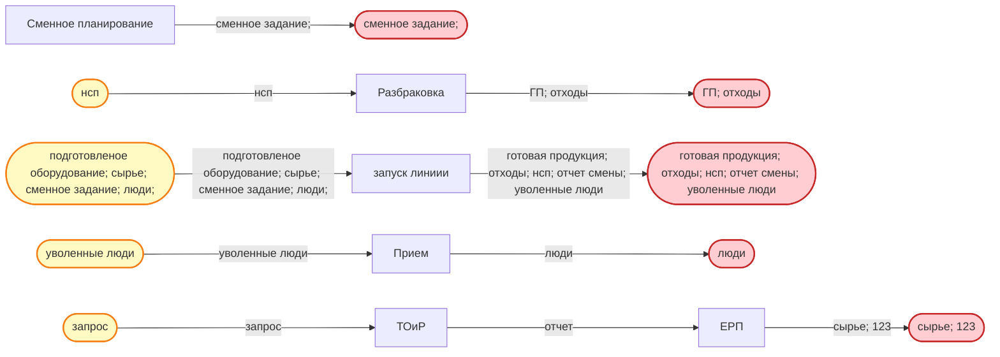

# Диаграмма бизнес-процесса

## Визуальное представление процесса

## Анализ узлов слияния, разветвления и супер-критичных точек

### Супер-критические операции (одновременно ≥ 3 входов и выход используется ≥ 3 раз):
- Таких операций нет

### Критические точки слияния:
- Нет точек слияния

### Критические точки разветвления:
- Нет точек разветвления

## Реестр входов/выходов

| Вход/Выход | Исходная операция | Последующие операции |
|---|---|---|
| ГП; отходы | Разбраковка | КОНЕЧНЫЙ ВЫХОД |
| готовая продукция; отходы; нсп; отчет смены; уволенные люди | запуск линиии | КОНЕЧНЫЙ ВЫХОД |
| запрос | ВНЕШНИЙ ВХОД | ТОиР |
| люди | Прием | КОНЕЧНЫЙ ВЫХОД |
| нсп | ВНЕШНИЙ ВХОД | Разбраковка |
| отчет | ТОиР | ЕРП |
| подготовленое оборудование; сырье; сменное задание; люди; | ВНЕШНИЙ ВХОД | запуск линиии |
| сменное задание; | Сменное планирование | КОНЕЧНЫЙ ВЫХОД |
| сырье; 123 | ЕРП | КОНЕЧНЫЙ ВЫХОД |
| уволенные люди | ВНЕШНИЙ ВХОД | Прием |

## Реестр операций

| Операция | Владелец | Входы | Выход | Тип узла |
|---|---|---|---|---|
| запуск линиии | оператор | подготовленое оборудование; сырье; сменное задание; люди; | готовая продукция; отходы; нсп; отчет смены; уволенные люди | Обычный |
| ТОиР | директор | запрос | отчет | Обычный |
| Сменное планирование | директор | - | сменное задание; | Обычный |
| ЕРП | None | отчет | сырье; 123 | Обычный |
| Прием | None | уволенные люди | люди | Обычный |
| Разбраковка | оператор | нсп | ГП; отходы | Обычный |

## Статистика процесса

- **Всего операций**: 6
- **Владельцы в данных**: 2
- **Внешние входы**: 4
- **Конечные выходы**: 5
- **Операций слияния**: 0
- **Операций разветвления**: 0
- **Супер-критических операций**: 0

## Легенда

- **Желтые овалы** – внешние входы
- **Красные овалы** – конечные выходы
- **Оранжевые прямоугольники** – операции слияния
- **Фиолетовые прямоугольники** – операции разветвления
- **Пульсирующие красные прямоугольники** – супер-критические операции
- **Обычные прямоугольники** – стандартные операции
