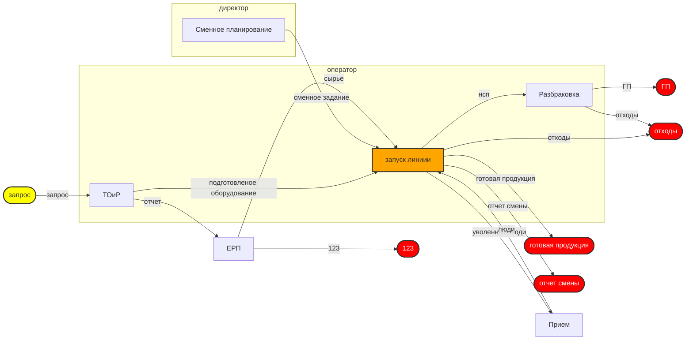

# Диаграмма бизнес-процесса

## Визуальное представление процесса

## Анализ узлов слияния, разветвления и супер-критичных точек

### Супер-критические операции (одновременно ≥ 3 входов и выход используется ≥ 3 раз):
- Таких операций нет

### Критические точки слияния:
- **запуск линиии**: 4 входов

### Критические точки разветвления:
- Нет точек разветвления

## Реестр входов/выходов

| Вход/Выход | Исходная операция | Последующие операции |
|---|---|---|
| 123 | ЕРП | КОНЕЧНЫЙ ВЫХОД |
| ГП | Разбраковка | КОНЕЧНЫЙ ВЫХОД |
| готовая продукция | запуск линиии | КОНЕЧНЫЙ ВЫХОД |
| запрос | ВНЕШНИЙ ВХОД | ТОиР |
| люди | Прием | запуск линиии |
| нсп | запуск линиии | Разбраковка |
| отходы | запуск линиии | КОНЕЧНЫЙ ВЫХОД |
| отчет | ТОиР | ЕРП |
| отчет смены | запуск линиии | КОНЕЧНЫЙ ВЫХОД |
| подготовленое оборудование | ТОиР | запуск линиии |
| сменное задание | Сменное планирование | запуск линиии |
| сырье | ЕРП | запуск линиии |
| уволенные люди | запуск линиии | Прием |

## Реестр операций

| Операция | Владелец | Входы | Выход | Тип узла |
|---|---|---|---|---|
| запуск линиии | оператор | люди, сменное задание, подготовленое оборудование, сырье | нсп, отходы, уволенные люди, готовая продукция, отчет смены | Слияние |
| ТОиР | оператор | запрос | подготовленое оборудование, отчет | Обычный |
| Сменное планирование | директор | - | сменное задание | Обычный |
| ЕРП |  | отчет | сырье, 123 | Обычный |
| Прием |  | уволенные люди | люди | Обычный |
| Разбраковка | оператор | нсп | ГП, отходы | Обычный |

## Статистика процесса

- **Всего операций**: 6
- **Владелец для диаграммы**: 2
- **Внешние входы**: 1
- **Конечные выходы**: 5
- **Операций слияния**: 1
- **Операций разветвления**: 0
- **Супер-критических операций**: 0

## Легенда

- **Желтые овалы** – внешние входы
- **Красные овалы** – конечные выходы
- **Оранжевые прямоугольники** – операции слияния
- **Фиолетовые прямоугольники** – операции разветвления
- **Пульсирующие красные прямоугольники** – супер-критические операции
- **Обычные прямоугольники** – стандартные операции
- **Группы на диаграмме** – зоны ответственности владелец
